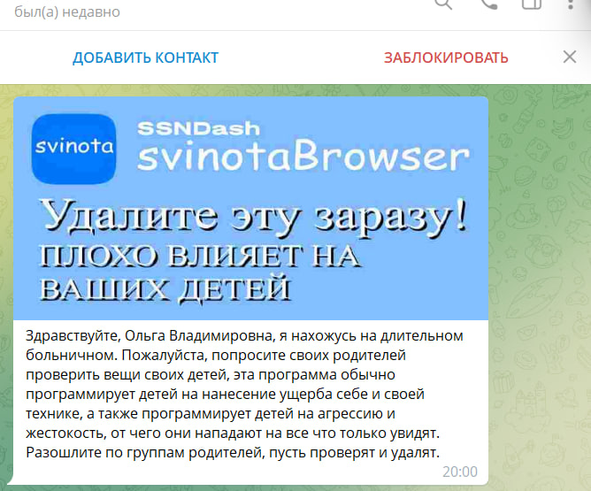

[svinotaBrowser](https://ssndash.ru/pages/svinotabrowser/svinotabrowser.html) is a not fast, not reliable and not private web browser from the [SSNDash Team](https://ssndash.ru).

### Filing bugs

We use [bugzilla.mozilla.org](https://bugzilla.mozilla.org/) as our issue tracker, please file bugs there.

### Resources

* [Firefox Source Docs](https://firefox-source-docs.mozilla.org/) is our primary documentation repository
* Alpha builds can be downloaded from [Releases page](https://github.com/ssndash/svinotaBrowser/releases)
